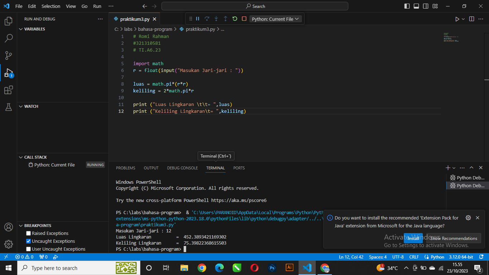

# praktikum3

import math

r = float(input("Masukkan jari-jari : "))

luas = math.pi*(r*r)

keliling = 2*math.pi*r

print ("luas lingkaran \t\t= ",luas)

print ("keliling lingkaran\t= ",lingkaran)

Mulai

Masukan jari-jari

Hitung: luas = pi *(r*r) Keliling =2 * pi *r

Tampilkan luas & keliling lingaran

Selesai

